# My Advent of Code

<!-- AOC TILES BEGIN -->
<h1 align="center">
  Advent of Code - 224/550 ⭐
</h1>
<h1 align="center">
  2025 - 14 ⭐ - Kotlin
</h1>
<a href="AoC/src/Year2025/Day01.kt">
  
</a>
<a href="AoC/src/Year2025/Day02.kt">
  
</a>
<a href="AoC/src/Year2025/Day03.kt">
  
</a>
<a href="AoC/src/Year2025/Day04.kt">
  
</a>
<a href="AoC/src/Year2025/Day05.kt">
  
</a>
<a href="AoC/src/Year2025/Day06.kt">
  
</a>
<a href="AoC/src/Year2025/Day07.kt">
  
</a>
<h1 align="center">
  2024 - 50 ⭐ - Kotlin
</h1>
<a href="AoC/src/Year2024/Day01.kt">
  
</a>
<a href="AoC/src/Year2024/Day02.kt">
  
</a>
<a href="AoC/src/Year2024/Day03.kt">
  
</a>
<a href="AoC/src/Year2024/Day04.kt">
  
</a>
<a href="AoC/src/Year2024/Day05.kt">
  
</a>
<a href="AoC/src/Year2024/Day06.kt">
  
</a>
<a href="AoC/src/Year2024/Day07.kt">
  
</a>
<a href="AoC/src/Year2024/Day08.kt">
  
</a>
<a href="AoC/src/Year2024/Day09.kt">
  
</a>
<a href="AoC/src/Year2024/Day10.kt">
  
</a>
<a href="AoC/src/Year2024/Day11.kt">
  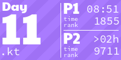
</a>
<a href="AoC/src/Year2024/Day12.kt">
  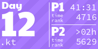
</a>
<a href="AoC/src/Year2024/Day13.kt">
  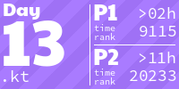
</a>
<a href="AoC/src/Year2024/Day14.kt">
  
</a>
<a href="AoC/src/Year2024/Day15.kt">
  
</a>
<a href="AoC/src/Year2024/Day16.kt">
  
</a>
<a href="AoC/src/Year2024/Day17.kt">
  
</a>
<a href="AoC/src/Year2024/Day18.kt">
  
</a>
<a href="AoC/src/Year2024/Day19.kt">
  
</a>
<a href="AoC/src/Year2024/Day20.kt">
  
</a>
<a href="AoC/src/Year2024/Day21.kt">
  
</a>
<a href="AoC/src/Year2024/Day22.kt">
  
</a>
<a href="AoC/src/Year2024/Day23.kt">
  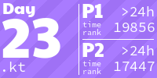
</a>
<a href="AoC/src/Year2024/Day24.kt">
  
</a>
<a href="AoC/src/Year2024/Day25.kt">
  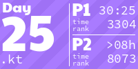
</a>
<h1 align="center">
  2023 - 50 ⭐ - Kotlin
</h1>
<a href="AoC/src/Year2023/Day01.kt">
  
</a>
<a href="AoC/src/Year2023/Day02.kt">
  
</a>
<a href="AoC/src/Year2023/Day03.kt">
  
</a>
<a href="AoC/src/Year2023/Day04.kt">
  
</a>
<a href="AoC/src/Year2023/Day05.kt">
  
</a>
<a href="AoC/src/Year2023/Day06.kt">
  
</a>
<a href="AoC/src/Year2023/Day07.kt">
  
</a>
<a href="AoC/src/Year2023/Day08.kt">
  
</a>
<a href="AoC/src/Year2023/Day09.kt">
  
</a>
<a href="AoC/src/Year2023/Day10.kt">
  
</a>
<a href="AoC/src/Year2023/Day11.kt">
  
</a>
<a href="AoC/src/Year2023/Day12.kt">
  
</a>
<a href="AoC/src/Year2023/Day13.kt">
  
</a>
<a href="AoC/src/Year2023/Day14.kt">
  
</a>
<a href="AoC/src/Year2023/Day15.kt">
  
</a>
<a href="AoC/src/Year2023/Day16.kt">
  
</a>
<a href="AoC/src/Year2023/Day17.kt">
  
</a>
<a href="AoC/src/Year2023/Day18.kt">
  
</a>
<a href="AoC/src/Year2023/Day19.kt">
  
</a>
<a href="AoC/src/Year2023/Day20.kt">
  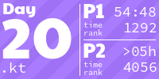
</a>
<a href="AoC/src/Year2023/Day21.kt">
  
</a>
<a href="AoC/src/Year2023/Day22.kt">
  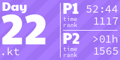
</a>
<a href="AoC/src/Year2023/Day23.kt">
  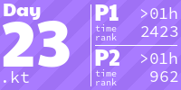
</a>
<a href="AoC/src/Year2023/Day24.kt">
  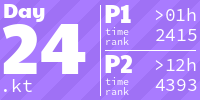
</a>
<a href="AoC/src/Year2023/Day25.kt">
  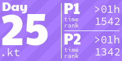
</a>
<h1 align="center">
  2022 - 50 ⭐ - Kotlin
</h1>
<a href="AoC/src/Year2022/Day01.kt">
  
</a>
<a href="AoC/src/Year2022/Day02.kt">
  
</a>
<a href="AoC/src/Year2022/Day03.kt">
  
</a>
<a href="AoC/src/Year2022/Day04.kt">
  
</a>
<a href="AoC/src/Year2022/Day05.kt">
  
</a>
<a href="AoC/src/Year2022/Day06.kt">
  
</a>
<a href="AoC/src/Year2022/Day07.kt">
  
</a>
<a href="AoC/src/Year2022/Day08.kt">
  
</a>
<a href="AoC/src/Year2022/Day09.kt">
  
</a>
<a href="AoC/src/Year2022/Day10.kt">
  
</a>
<a href="AoC/src/Year2022/Day11.kt">
  
</a>
<a href="AoC/src/Year2022/Day12.kt">
  
</a>
<a href="AoC/src/Year2022/Day13.kt">
  
</a>
<a href="AoC/src/Year2022/Day14.kt">
  
</a>
<a href="AoC/src/Year2022/Day15.kt">
  
</a>
<a href="AoC/src/Year2022/Day16.kt">
  
</a>
<a href="AoC/src/Year2022/Day17.kt">
  
</a>
<a href="AoC/src/Year2022/Day18.kt">
  
</a>
<a href="AoC/src/Year2022/Day19.kt">
  
</a>
<a href="AoC/src/Year2022/Day20.kt">
  
</a>
<a href="AoC/src/Year2022/Day21.kt">
  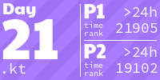
</a>
<a href="AoC/src/Year2022/Day22.kt">
  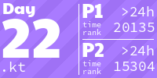
</a>
<a href="AoC/src/Year2022/Day23.kt">
  
</a>
<a href="AoC/src/Year2022/Day24.kt">
  
</a>
<a href="AoC/src/Year2022/Day25.kt">
  
</a>
<h1 align="center">
  2021 - 50 ⭐ - Kotlin
</h1>
<a href="AoC/src/Year2021/Day01/part1.kt">
  
</a>
<a href="AoC/src/Year2021/Day02/common.kt">
  
</a>
<a href="AoC/src/Year2021/Day03/part1.kt">
  
</a>
<a href="AoC/src/Year2021/Day04/common.kt">
  
</a>
<a href="AoC/src/Year2021/Day05/common.kt">
  
</a>
<a href="AoC/src/Year2021/Day06/part1.kt">
  
</a>
<a href="AoC/src/Year2021/Day07/part1.kt">
  
</a>
<a href="AoC/src/Year2021/Day08/part1.kt">
  
</a>
<a href="https://adventofcode.com/2021/day/9">
  
</a>
<a href="https://adventofcode.com/2021/day/10">
  
</a>
<a href="AoC/src/Year2021/Day11.kt">
  
</a>
<a href="AoC/src/Year2021/Day12.kt">
  
</a>
<a href="AoC/src/Year2021/Day13.kt">
  
</a>
<a href="AoC/src/Year2021/Day14.kt">
  
</a>
<a href="AoC/src/Year2021/Day15.kt">
  
</a>
<a href="AoC/src/Year2021/Day16.kt">
  
</a>
<a href="AoC/src/Year2021/Day17.kt">
  
</a>
<a href="AoC/src/Year2021/Day18.kt">
  
</a>
<a href="AoC/src/Year2021/Day19.kt">
  
</a>
<a href="AoC/src/Year2021/Day20.kt">
  
</a>
<a href="AoC/src/Year2021/Day21.kt">
  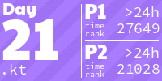
</a>
<a href="AoC/src/Year2021/Day22.kt">
  
</a>
<a href="AoC/src/Year2021/Day23.kt">
  
</a>
<a href="AoC/src/Year2021/Day24.kt">
  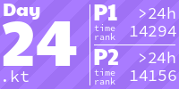
</a>
<a href="AoC/src/Year2021/Day25.kt">
  
</a>
<h1 align="center">
  2015 - 10 ⭐ - Kotlin
</h1>
<a href="AoC/src/Year2015/Day01.kt">
  
</a>
<a href="AoC/src/Year2015/Day02.kt">
  
</a>
<a href="AoC/src/Year2015/Day03.kt">
  
</a>
<a href="AoC/src/Year2015/Day04.kt">
  
</a>
<a href="AoC/src/Year2015/Day05.kt">
  
</a>
<!-- AOC TILES END -->

---

[Advent of Code][aoc] – An annual event of Christmas-oriented programming challenges started December 2015. Every year since then, beginning on the first day of December, a programming puzzle is published every day for twenty-five days. You can solve the puzzle and provide an answer using the language of your choice.

All solutions here are written in Kotlin.

## Repository layout

```
AoC/src/
├── Utils.kt              shared helpers: grids, points, directions, BFS, parsing
├── Year2015/DayNN.kt     one file per day
├── Year2021/
│   ├── DayNN/            days 1–8 predate the current layout: one file per part
│   └── DayNN.kt
├── Year2022/DayNN.kt
├── Year2023/DayNN.kt
├── Year2024/DayNN.kt
└── Year2025/DayNN.kt

AoC/res/                  puzzle inputs — not committed, see below
.aoc_tiles/tiles/         generated tile images shown above
.github/workflows/        tile regeneration
```

## Running a solution

The project has no build file yet — open the repository in IntelliJ IDEA and run
the `main` function of the day you want. The working directory of the run
configuration must be `AoC/`, because inputs are resolved relative to it.

## Puzzle inputs

Inputs are deliberately not committed: Advent of Code [asks that they not be
republished][aoc-inputs], and they differ per account. `AoC/res/` is gitignored,
so download your own and place them as:

```
AoC/res/Year2024/Day01.txt          most years
AoC/res/Year2021/Day01/input.txt    2021, days 1–8
```

A day fails with a `FileNotFoundException` when its input is missing.

## Tiles

The graphic at the top is generated by [aoc-tiles][aoc-tiles] and refreshed
automatically by [`.github/workflows/aoc-tiles.yml`](.github/workflows/aoc-tiles.yml)
whenever solutions under `AoC/src/` are pushed. Everything between the
`AOC TILES BEGIN` and `AOC TILES END` markers above is overwritten on each run,
so edit it only through the tool.

Solve time and rank come from the personal AoC leaderboard, which needs
authentication. Store the `session` cookie from adventofcode.com as a repository
secret named `AOC_SESSION_COOKIE` (Settings → Secrets and variables → Actions).
It expires roughly every 30 days and has to be refreshed. Without the secret the
workflow still succeeds, but the tiles show plain checkmarks instead of times.

To regenerate locally instead, put the same cookie in `.aoc_tiles/session.cookie`
(gitignored) and run:

```
pip install aoc-tiles==0.7.2
aoc-tiles --aoc-dir . --count-as-solved-when on_leaderboard --what-to-show-on-right-side time_and_rank
```

[aoc]: https://adventofcode.com
[aoc-inputs]: https://adventofcode.com/about
[aoc-tiles]: https://github.com/LiquidFun/aoc_tiles
