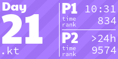
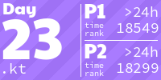

# My Advent of Code

<!-- AOC TILES BEGIN -->
<h1 align="center">
  2024 - 47 ⭐
</h1>

<h1 align="center">
  2023 - 50 ⭐
</h1>

<h1 align="center">
  2022 - 50 ⭐
</h1>

<h1 align="center">
  2021 - 42 ⭐
</h1>

<h1 align="center">
  2015 - 10 ⭐
</h1>

<!-- AOC TILES END -->

---
The graphic above has been created with the [AoCTiles script][aoc-tiles].

---
[Advent of Code][aoc] – An annual event of Christmas-oriented programming challenges started December 2015. Every year since then, beginning on the first day of December, a programming puzzle is published every day for twenty-five days. You can solve the puzzle and provide an answer using the language of your choice.

[aoc]: https://adventofcode.com
[aoc-tiles]: https://github.com/LiquidFun/adventofcode/tree/main/AoCTiles
